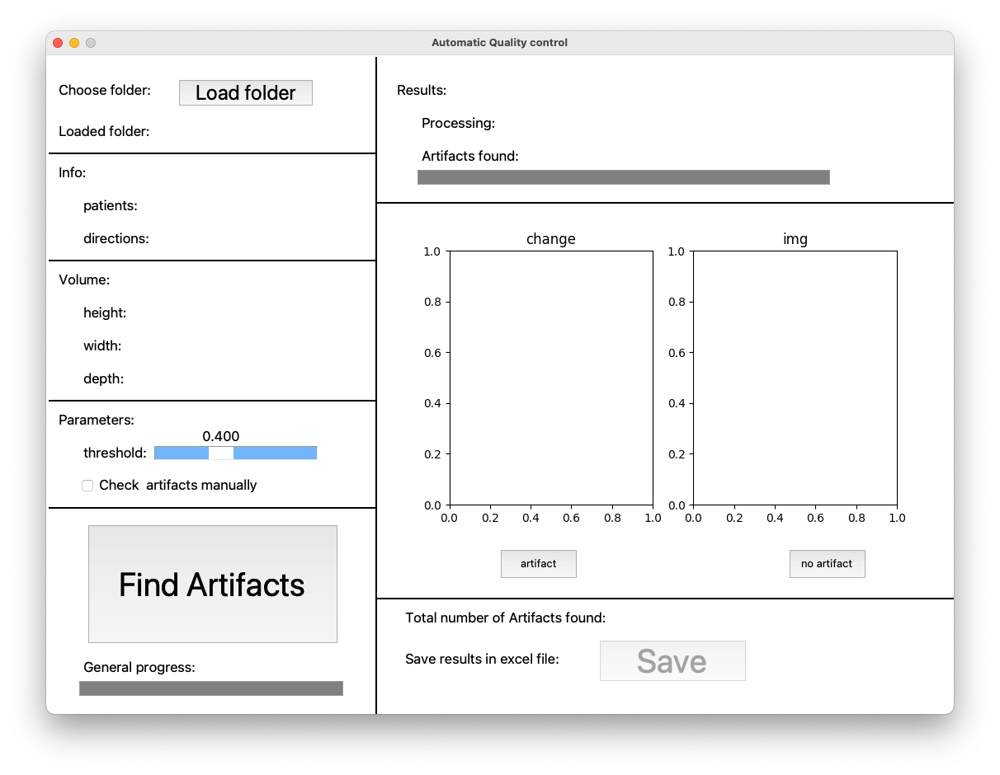
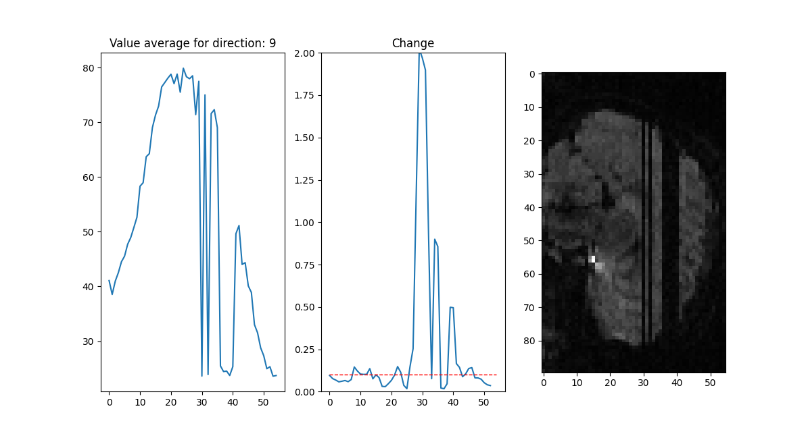
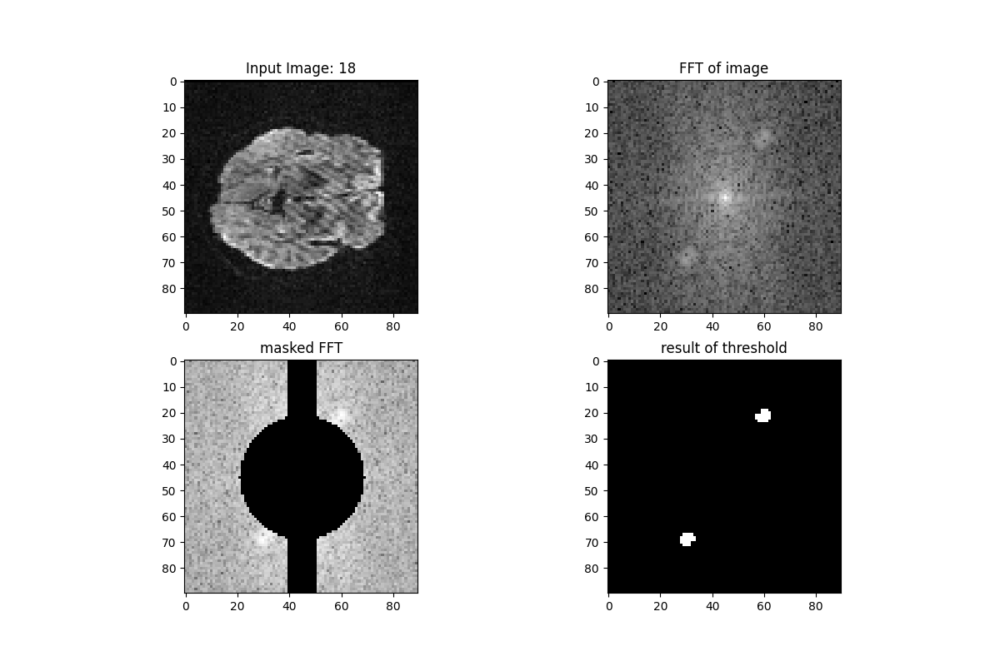

# Artefact Detection in DWI Data

This Python application is designed to detect and remove artefacts in Diffusion Weighted Imaging (DWI) data. It features an integrated GUI and is compatible with MacOS. The project was developed during an internship at the INM-7 institute, part of the Jülich Forschungszentrum.

## Features
- Detects line artefacts in DWI data, which resemble black lines that span one or more brain slices.
- Takes a folder containing NIfTI files as input.
- Outputs an Excel file detailing which file and volume contain artefacts.
- Allows user-defined brightness threshold for artefact detection.
  
## Methodology
The application detects artefacts by calculating the mean brightness of each brain slice and identifying significant changes in brightness from one slice to another. If the change in brightness surpasses a user-defined threshold, the program reports an artefact.

## Future Work

Future versions of the application aim to detect wave artefacts in the data using Fourier transform. This feature is currently under development and not yet available due to challenges in normalizing brightness across different brain volumes.

## Dependencies

If you don't have access to Mac OS, or you want to  run the program inside a terminal (cmd) the app will require the following Python modules:
- Numpy
- Tkinter
- Nibabel
- Matplotlib

## Acknowledgments 

Special thanks to Lya Katarina Paas Oliveros and Kyesam Jung who helped me throughout the project.
Also this project could not have been done if it weren't for Robert Langner who supervised it.

## Demo 

You can find a demo of the program here: 
https://github.com/ViRoLam/DWI_artefact/assets/137409570/a3ca5015-08d5-40e1-91ab-d8b9bd33be0a

